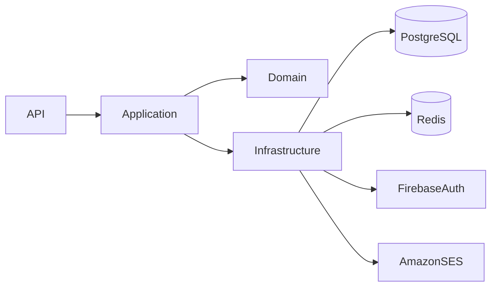
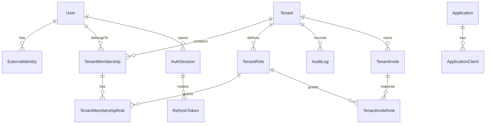
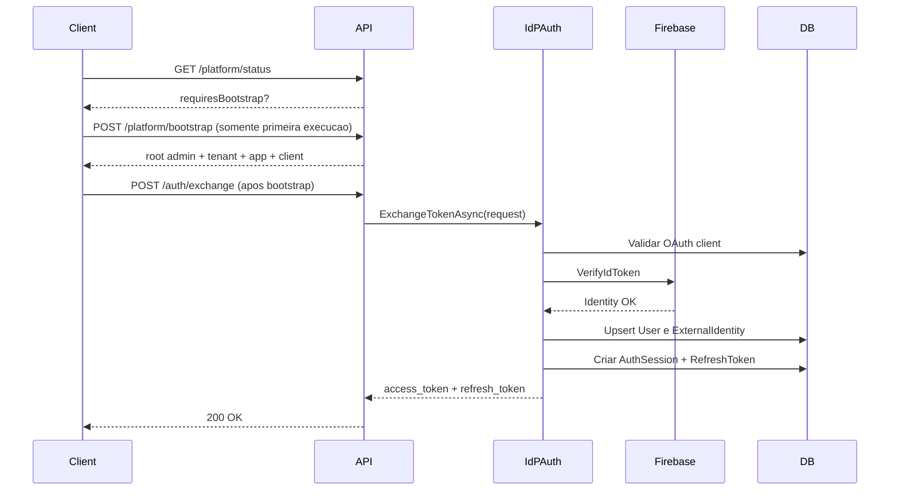
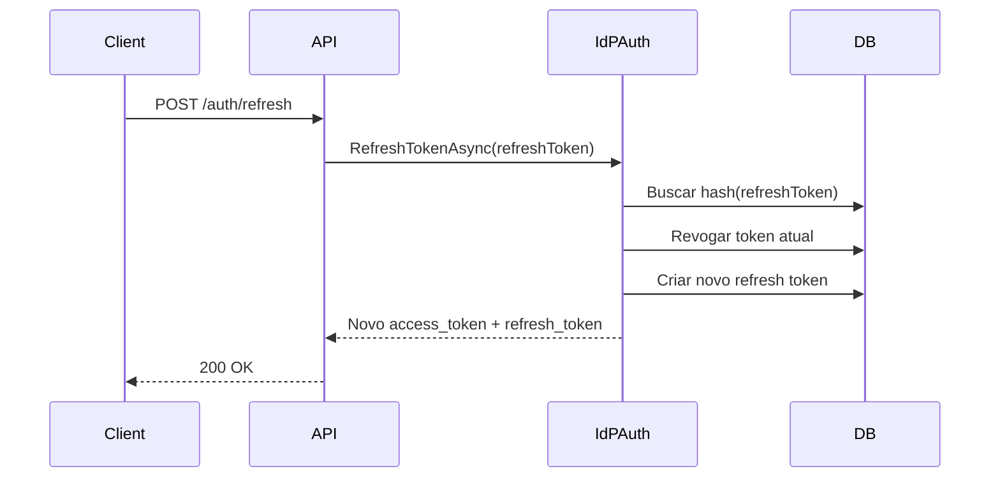
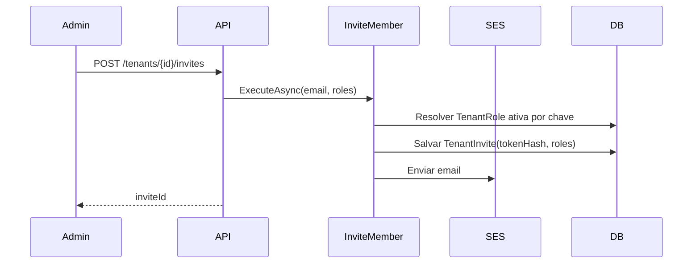

# IdPPlatform - Product Documentation

## 1. Documento

- Produto: `IdPPlatform Backend`
- Tipo: Especificacao funcional e tecnica de produto
- Linguagem: PT-BR
- Escopo: API de Identity Provider multi-tenant
- Baseado no estado implementado atual do sistema

---

## 2. Visao do Produto

O `IdPPlatform` e um Identity Provider (IdP) multi-tenant para centralizar autenticacao e autorizacao de aplicacoes do ecossistema (ERP, CRM, apps mobile e servicos backend).

Objetivos principais:

- centralizar login e sessao para multiplas aplicacoes
- isolar contexto por tenant
- emitir tokens proprios para consumo interno
- manter rastreabilidade de seguranca e auditoria
- habilitar onboarding de usuarios por convite

---

## 3. Escopo do Produto

### 3.1 Em Escopo

- token exchange com identidade externa (Firebase)
- emissao de `access_token` e `refresh_token` proprios
- rotacao de refresh token
- troca de tenant em sessao ativa
- encerramento de sessao (logout)
- endpoint JWKS para validacao de token por consumidores
- CRUD de tenants e memberships
- CRUD de applications e application clients
- validacao de OAuth client no exchange (`client_id`, `client_secret`, redirect URI, scopes)
- PKCE para clients publicos
- rate limiting nos endpoints de autenticacao
- listagem e revogacao de sessoes ativas
- limite maximo de sessoes por usuario
- auditoria automatica via interceptor
- consulta paginada de logs de auditoria
- consultas paginadas para tenants, memberships, tenant roles e applications
- convite por email e aceite de convite

### 3.2 Fora de Escopo Atual

- authorization code flow OIDC completo
- consent screen e gerenciamento de consentimentos
- MFA/TOTP/SMS
- SCIM
- webhooks outbound de eventos de identidade
- federacao com outros IdPs alem de Firebase

---

## 4. Stakeholders e Perfis

- Usuario final: autentica e usa aplicacoes do tenant
- Admin de tenant: gerencia membros e acessos do tenant
- Owner de tenant: governanca total do tenant
- Aplicacao consumidora: integra com API para obter tokens
- Equipe de plataforma: opera o IdP e monitora seguranca

---

## 5. Requisitos Funcionais

## RF-001 - Token Exchange
- O sistema deve receber um `identityToken` externo valido.
- O sistema deve validar o client OAuth associado (`clientId` obrigatorio).
- Para clients confidential, `clientSecret` deve ser validado.
- Para clients publicos, PKCE deve ser validado.
- O sistema deve emitir `access_token` e `refresh_token`.

## RF-002 - Refresh Token
- O sistema deve aceitar refresh token valido.
- O sistema deve revogar token antigo e emitir um novo (rotacao).

## RF-003 - Switch Tenant
- O usuario autenticado deve poder trocar contexto de tenant.
- A troca deve validar membership ativo no tenant de destino.

## RF-004 - Logout
- O sistema deve revogar refresh token informado.
- A sessao associada deve ser revogada.

## RF-005 - JWKS
- O sistema deve expor `/.well-known/jwks.json` para validacao de JWT.

## RF-006 - Gestao de Sessao
- O sistema deve listar sessoes ativas do usuario autenticado.
- O sistema deve revogar sessao especifica por `sessionId`.
- O sistema deve limitar numero maximo de sessoes ativas por usuario.

## RF-007 - Auditoria
- O sistema deve registrar automaticamente eventos sensiveis.
- O sistema deve permitir consulta paginada de logs com filtros.

## RF-008 - Convites
- O admin/owner deve criar convite por email para tenant.
- As roles informadas no convite devem ser resolvidas por chave e estar ativas no tenant.
- A expiracao do convite deve respeitar a politica configurada em `Invite.ExpirationHours`.
- O usuario convidado deve aceitar convite com token de convite + identidade externa.

---

## 6. Requisitos Nao Funcionais

## RNF-001 - Seguranca
- JWT assinado e validado por issuer/audience/signing key.
- Hash de refresh tokens no banco.
- Validacao obrigatoria de client no exchange.
- Rate limiting para reduzir brute force.

## RNF-002 - Isolamento Multi-tenant
- Dados tenant-scoped devem respeitar filtro de tenancy.
- Contexto de tenant resolvido por claims.

## RNF-003 - Observabilidade
- Eventos de seguranca devem ser auditaveis.
- Erros devem retornar `application/problem+json`.

## RNF-004 - Evolutividade
- Arquitetura em camadas (`Domain`, `Application`, `Infrastructure`, `API`).
- Separacao de contratos e implementacoes por interfaces.

---

## 7. Arquitetura

Camadas:

- `IdPPlatform.Domain`: entidades, enums, regras de dominio, contratos de repositorio
- `IdPPlatform.Application`: contratos de servico, interfaces compartilhadas, DTOs e casos de uso
- `IdPPlatform.Infrastructure`: EF Core, repositorios, queries, servicos concretos de autenticacao, Firebase, email, auditoria e resolucao de roles
- `IdPPlatform.API`: controllers, middlewares, versionamento, pipeline HTTP

Convencoes da camada Application:

- Requests, responses, DTOs e results sao `sealed record` com propriedades no corpo e setters `init`.
- Contratos ficam em Application; implementacoes concretas que dependem de persistencia, configuracao ou servicos externos ficam em Infrastructure.
- Queries concretas ficam em Infrastructure; Application expoe apenas interfaces, requests e DTOs desses fluxos de leitura.
- DTOs de leitura ficam agrupados em pastas `Dtos` do respectivo contexto, por exemplo `AuditLogs/Dtos` e `User/Dtos`.
- Tipos paginados usam `PagedRequest`, `PagedResult<T>` e o contrato comum `IPaged`.
- Use cases, queries e actions usam `Get*` para item unico e `List*` para colecoes ou resultados paginados.

Convencoes da camada Infrastructure:

- Configuracoes EF usam cadeia fluente com uma chamada por linha para manter leitura e revisao consistentes.
- Repositories e queries quebram o acesso EF em linhas encadeadas, no mesmo estilo de `TenantStore`.
- Mensagens de erro de aplicacao ficam centralizadas em `ApplicationErrorMessages`; titulos HTTP ficam em `ApiErrorMessages`.
- Objetos auxiliares de queries administrativas, como filtros de auditoria, nao fazem parte do Domain.
- Repositorios usam `AddAsync` para criacao, `GetForUpdateAsync` para busca rastreada por id, `GetBy<ParamName>Async` para outros parametros, `AlreadyExistsAsync` para existencia e sufixo `With<RelationshipName>Async` quando carregam relacionamentos.

Fluxo macro:

---

## 8. Modelagem de Dominio

Entidades principais:

- `User`
- `ExternalIdentity`
- `Tenant`
- `TenantRole`
- `TenantMembership`
- `Application`
- `ApplicationClient`
- `AuthSession`
- `RefreshToken`
- `AuditLog`
- `TenantInvite`

Value Objects:

- `EmailAddress`
- `TenantKey`
- `TenantRoleKey`

Enums principais:

- `ClientType` (`Public`, `Confidential`)
- `SessionStatus` (`Active`, `Revoked`, `Expired`)
- `ApplicationType` (`Web`, `Mobile`, `Backend`)
- `AuditAction`

Modelo ER simplificado:

---

## 9. Integracoes Externas

## 9.1 Firebase Authentication
- Uso: validacao de `identityToken` no exchange e aceite de convite.
- Integracao: `FirebaseAdmin` (`VerifyIdTokenAsync`).
- Credenciais: `Firebase:CredentialPath` (quando configurado) ou Application Default Credentials.
- Projeto: `Firebase:ProjectId` (obrigatorio).

## 9.2 PostgreSQL
- Persistencia principal via EF Core + Npgsql.
- Migracoes versionadas no projeto `Infrastructure`.

## 9.3 AWS SES
- Uso: envio de convite por email.
- Integracao: `AmazonSimpleEmailServiceV2Client`.
- Config obrigatoria: `Email.FromAddress` e `Email.Region`.
- Credenciais preferenciais em appsettings: `Email.AccessKeyId`, `Email.SecretAccessKey`, `Email.SessionToken`.

## 9.4 Redis
- Uso: cache de resolucao de tenant por `TenantKey` no `TenantStore`.
- Config: `Redis.ConnectionString`, `Redis.InstanceName`, `Redis.TenantIdentifierCacheMinutes`.

## 9.5 TenancyKit
- Uso: resolucao de tenant por claims e filtros de dados tenant-scoped.

---

## 10. Contratos de API (Resumo)

## 10.1 Auth
- `GET /v1/platform/status` (anonimo)
- `POST /v1/platform/bootstrap` (anonimo, rate-limited, uso unico)
- `POST /v1/auth/exchange` (anonimo, rate-limited)
- `POST /v1/auth/refresh` (anonimo, rate-limited)
- `POST /v1/auth/switch-tenant` (autenticado)
- `POST /v1/auth/logout` (anonimo)
- `GET /v1/auth/sessions` (autenticado)
- `DELETE /v1/auth/sessions/{sessionId}` (autenticado)

## 10.2 Tenants
- `POST /v1/tenants` (autenticado + `PlatformAdministrator`)
- `GET /v1/tenants` (paginado por `page` e `pageSize`)
- `GET /v1/tenants/{id}` (`plat_admin` ou role administrativa `owner`/`admin` no tenant alvo)
- `PATCH /v1/tenants/{id}` (`plat_admin` ou role administrativa `owner`/`admin` no tenant alvo)
- `GET /v1/tenants/{id}/roles` (paginado por `page` e `pageSize`)
- `POST /v1/tenants/{id}/roles`
- `POST /v1/tenants/{id}/invites` (`plat_admin` ou role administrativa `owner`/`admin` no tenant alvo)
- `POST /v1/invites/accept` (anonimo)

## 10.3 Memberships
- `POST /v1/tenants/{tenantId}/memberships`
- `GET /v1/tenants/{tenantId}/memberships` (paginado por `page` e `pageSize`)
- `PATCH /v1/memberships/{id}`
- `DELETE /v1/memberships/{id}`

## 10.4 Applications
- `POST /v1/applications` (autenticado + `PlatformAdministrator`)
- `GET /v1/applications` (paginado por `page` e `pageSize`)
- `GET /v1/applications/{id}`
- `POST /v1/applications/{id}/clients` (autenticado; requer `plat_admin` ou role administrativa `owner`/`admin` no tenant alvo)

## 10.5 Users
- `GET /v1/users/me`
- `PATCH /v1/users/me`
- `GET /v1/users/me/memberships` (paginado por `page` e `pageSize`)

## 10.6 Audit
- `GET /v1/auditlogs` via `ListAuditLogs` (autenticado; tenant role `owner`/`admin`; paginado por `page` e `pageSize`)

## 10.7 Well-known
- `GET /.well-known/jwks.json`

---

## 11. Fluxos de Negocio

### 11.1 Exchange + Sessao

### 11.2 Refresh com Rotacao

### 11.3 Convite

---

## 12. Modelo de Token e Claims

Claims emitidas no JWT:

- `sub`: subject do usuario
- `uid`: identificador do usuario
- `sid`: identificador da sessao
- `email`: email do usuario
- `tid`: tenant ativo
- `mid`: membership ativa
- `trole`: role no tenant; pode aparecer multiplas vezes
- `prole`: role administrativa de plataforma; pode aparecer multiplas vezes
- `amr`: metodo de autenticacao

Uso de claims:

- autorizacao por tenant roles
- autorizacao administrativa de plataforma via `prole=plat_admin`
- resolucao de tenant no TenancyKit
- operacoes de sessao por `sid`

---

## 13. Configuracoes de Produto

Secoes de configuracao:

- `Database`
- `Firebase`
- `Jwt`
- `Session`
- `RateLimit`
- `Invite`
- `Email`
- `EnvironmentVariablesDocumentation`

Parametros criticos:

- `Jwt.SigningKey`
- `Session.MaxSessionsPerUser`
- `RateLimit.*`
- `Invite.ExpirationHours`
- `Email.FromAddress`
- `Firebase.ProjectId`

---

## 14. Seguranca e Hardening Implementado

- validacao de OAuth client no exchange
- bootstrap inicial bloqueado apos primeira execucao
- bootstrap cria configuracoes de negocio via UI (sem seeds de tenant/app/client em migracao)
- validacao de redirect URI e scopes permitidos
- PKCE para clients publicos
- refresh token hash no banco
- rotacao de refresh token
- revogacao de sessao e tokens
- rate limiting em endpoints de auth
- auditoria automatica de eventos sensiveis

---

## 15. Auditoria e Observabilidade

Eventos auditados por interceptor:

- criacao/atualizacao de usuario
- criacao/atualizacao de tenant
- criacao/revogacao de membership
- criacao/revogacao de sessao
- criacao/aceite de convite
- interceptacao nos fluxos `SavingChanges` e `SavingChangesAsync`

Consulta:

- endpoint paginado com filtros por `userId`, `action`, `resourceType`, `from`, `to`
- listagens administrativas usam envelope `PagedResult<T>` com `items`, `total`, `page` e `pageSize`

---

## 16. Regras de Negocio Relevantes

- apenas `plat_admin` cria tenants e applications globais
- criador do tenant recebe membership `owner` automaticamente no tenant criado
- criacao de application client exige `plat_admin` ou membership ativa com role `owner`/`admin` no tenant alvo
- usuario precisa de membership ativa para operar no tenant do client (quando houver memberships)
- confidential client sem secret valido nao autentica
- public client sem PKCE nao autentica
- sessao so pode ser revogada pelo proprio usuario
- convite expirado ou consumido nao pode ser reutilizado
- email autenticado deve coincidir com email do convite
- convite deve conter ao menos uma role ativa e nao duplicada no tenant

---

## 17. Estrategia de Testes Recomendada

## 17.1 Unitarios
- validacao de client OAuth
- validacao PKCE
- regras de sessao (limite/revogacao)
- regras de convite (expiracao/consumo)

## 17.2 Integracao API
- fluxo completo exchange -> refresh -> logout
- troca de tenant e emissao de claims
- listagem/revogacao de sessoes
- criacao/aceite de convite
- leitura de audit logs com autorizacao por roles

## 17.3 Seguranca
- brute force em `exchange` e `refresh` (verificar rate limit)
- tentativa de revogar sessao de outro usuario
- tentativa de usar redirect URI invalida

---

## 18. Riscos, Limitacoes e Proximos Passos

Riscos atuais:

- fluxo OAuth2/OIDC ainda parcial (sem authorization code completo)
- sem MFA nativo
- sem eventos outbound (webhooks/filas) para incidentes de seguranca

Prioridades sugeridas de evolucao:

1. authorization code flow completo + consent
2. MFA/TOTP
3. webhooks e/ou fila de eventos de seguranca
4. suporte a federacao com Google/Microsoft/SAML

---

## 19. Definicao de Pronto (Produto)

Para considerar o modulo de identidade pronto para ambiente produtivo:

- migracoes aplicadas com sucesso
- chaves e secrets configurados por ambiente
- testes de integracao de fluxos criticos aprovados
- monitoramento de erros e auditoria operacional ativo
- playbook de revogacao e resposta a incidente definido

