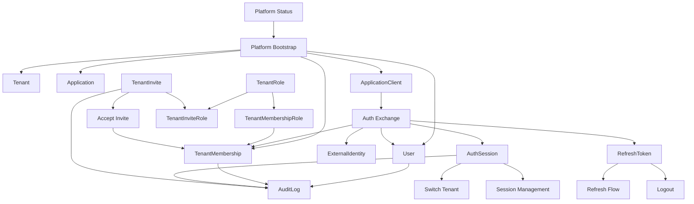

# IdPPlatform - Guia de Entidades e Fluxos

## 1. Objetivo deste guia

Este documento explica:

- o que cada entidade do dominio representa
- qual problema de negocio cada fluxo resolve
- como entidades e fluxos se integram no ciclo de autenticacao/autorizacao

Ele complementa [PRODUCT_DOCUMENTATION.md](PRODUCT_DOCUMENTATION.md) com foco didatico e sem ambiguidades.

Para referencia exaustiva de entidades, value objects, metodos de dominio e invariantes, consulte [backend/DOMAIN.md](backend/DOMAIN.md).

Para services, commands e queries (camada Application), consulte [backend/APPLICATION.md](backend/APPLICATION.md).

---

## 2. Mapa mental do sistema

O sistema pode ser lido em quatro blocos:

- **Identidade**: quem e o usuario (`User`, `ExternalIdentity`)
- **Contexto de negocio**: em qual organizacao e com qual papel (`Tenant`, `TenantMembership`)
- **Aplicacoes clientes**: quem pode pedir token (`Application`, `ApplicationClient`)
- **Sessao e seguranca**: como acesso e concedido e rastreado (`AuthSession`, `RefreshToken`, `AuditLog`, `TenantInvite`)

---

## 3. Entidades do dominio: significado e integracao

## 3.1 `User`
Significa:
- identidade interna canonica do usuario no IdP

Responsabilidades:
- armazenar email, nome de exibicao, foto de perfil (`PhotoUrl`) e status ativo

Integra com:
- `ExternalIdentity` (origem externa de login)
- `TenantMembership` (vinculo com tenants)
- `AuthSession` (sessoes abertas por esse usuario)

---

## 3.2 `ExternalIdentity`
Significa:
- vinculacao entre um usuario interno e um provedor externo (hoje Firebase)

Responsabilidades:
- guardar `provider`, `providerUserId` e email do provedor como `EmailAddress`

Integra com:
- `User` (N:1)
- fluxo de `exchange` (cria/consulta esse vinculo)

---

## 3.3 `Tenant`
Significa:
- unidade organizacional isolada (empresa, conta, workspace)

Responsabilidades:
- delimitar fronteira de dados e governanca
- manter `TenantKey` unico (slug/chave)

Integra com:
- `TenantMembership` (usuarios participantes)
- `TenantRole` (catalogo de roles customizaveis)
- `ApplicationTenant` (vinculo app-tenant com metadados opcionais)
- `AuditLog` e `TenantInvite` (dados tenant-scoped)

Relacionamento com aplicacoes:
- `Tenant` nao referencia `Application` diretamente.
- O vinculo tenant-app acontece em `ApplicationTenant` (`ApplicationId` + `TenantId`, com `ExternalCustomerId` e `PlanCode` opcionais).
- `ApplicationClient` pertence a uma `Application` e identifica credenciais OAuth da app (sem `TenantId` na entidade).

---

## 3.4 `TenantMembership`
Significa:
- permissao de um usuario dentro de um tenant

Responsabilidades:
- guardar uma ou mais roles por meio de `TenantMembershipRole`
- controlar status ativo/revogado

Integra com:
- `User` e `Tenant`
- `TenantRole` (roles padrao ou customizadas do tenant)
- claims de tenant (`tid`, `mid`, multiplas `trole`) no JWT
- validacao de acesso no `switch-tenant` e fluxos administrativos

Observacao:
- administracao global (criacao de tenant e application) nao usa `trole`; usa claim de plataforma `prole=plat_admin`
- criacao de convites, atualizacao e consulta de tenant por id exigem `plat_admin` ou role administrativa (`owner`/`admin`) no tenant alvo

---

## 3.5 `Application`
Significa:
- sistema consumidor (CRM, ERP, app mobile, backend service)

Responsabilidades:
- agrupar clients OAuth por aplicacao
- classificar tipo da app (`Web`, `Mobile`, `Backend`)

Integra com:
- `ApplicationClient` (1:N)

---

## 3.6 `ApplicationClient`
Significa:
- credencial tecnica de uma aplicacao para acessar o IdP

Responsabilidades:
- identificar client (`client_id`)
- proteger client confidential (`client_secret_hash`)
- restringir `redirect_uris` e `allowed_scopes`
- definir tipo (`Public`/`Confidential`)

Integra com:
- fluxo de `exchange` (validacao de client)
- `AuthSession` (sessao registra qual client iniciou autenticacao)
- `Application` (N clients por aplicacao)

---

## 3.7 `ApplicationTenant`
Significa:
- vinculo entre uma aplicacao registrada e um tenant provisionado

Responsabilidades:
- associar `ApplicationId` e `TenantId`
- armazenar metadados opcionais (`ExternalCustomerId`, `PlanCode`) para billing/onboarding da app consumidora

Integra com:
- `ProvisionApplicationTenant` (admin de plataforma)
- `SubscribeTenant` (usuario autenticado via OAuth da app)

---

## 3.8 `AuthSession`
Significa:
- sessao autenticada de um usuario no IdP

Responsabilidades:
- controlar estado de sessao (`Active`, `Revoked`, `Expired`)
- registrar metadados (`UserAgent`, `IpAddress`)
- manter contexto atual de tenant/membership

Integra com:
- `RefreshToken` (rotacao e continuidade da sessao)
- claims `sid`, `tid`, `mid`, multiplas `trole` e, quando aplicavel, `prole`
- endpoints de listagem/revogacao de sessao

---

## 3.9 `RefreshToken`
Significa:
- credencial de renovacao de acesso para uma sessao

Responsabilidades:
- armazenar apenas hash do token
- permitir revogacao e expiracao
- habilitar rotacao segura

Integra com:
- `AuthSession`
- fluxos `refresh`, `logout`, `revoke-session`, limite de sessoes

---

## 3.10 `AuditLog`
Significa:
- trilha forense de eventos sensiveis de seguranca e administracao

Responsabilidades:
- registrar acao, recurso, ator e contexto de rede

Integra com:
- `AuditInterceptor` (criacao automatica)
- query `ListAuditLogs` exposta pelo endpoint paginado (`GET /v1/auditlogs`)
- DTOs de leitura de auditoria agrupados em `AuditLogs/Dtos` na camada Application

---

## 3.11 `TenantInvite`
Significa:
- convite controlado para entrada de novo membro em tenant

Responsabilidades:
- guardar email alvo como `EmailAddress`, roles, token hash, expiracao e consumo

Integra com:
- fluxo de convite (`POST /tenants/{id}/invites`)
- fluxo de aceite (`POST /invites/accept`)
- criacao de `TenantMembership`

---

## 3.12 `TenantRole`
Significa:
- role configuravel dentro de um tenant

Responsabilidades:
- manter chave estavel (`owner`, `admin`, `member`, `viewer` ou customizada)
- permitir ativacao/desativacao e nomes amigaveis
- servir como origem para roles de convites, memberships e claims

Integra com:
- `TenantMembershipRole`
- `TenantInviteRole`
- fluxos administrativos de roles (`/tenants/{tenantId}/roles`)

---

## 4. Fluxos de sistema: significado e integracao

## 4.1 Fluxo de Exchange (Login federado + emissao de token interno)
Objetivo:
- transformar identidade externa em sessao interna confiavel

Passos logicos:
1. validar client OAuth (`ApplicationClient`)
2. validar token externo (Firebase)
3. localizar/criar `User`
4. localizar/criar `ExternalIdentity`
5. resolver membership no tenant do client
6. criar `AuthSession`
7. criar `RefreshToken`
8. emitir JWT com claims de contexto

Regras de autorizacao relacionadas:
- criacao de tenant e application global exige `prole=plat_admin`
- criacao de application client exige `prole=plat_admin` ou role administrativa (`owner`/`admin`) no tenant do client

Entidades centrais:
- `ApplicationClient`, `User`, `ExternalIdentity`, `TenantMembership`, `AuthSession`, `RefreshToken`

---

## 4.2 Fluxo de Refresh (continuidade de sessao)
Objetivo:
- renovar acesso sem novo login externo

Passos logicos:
1. hash e busca do refresh token
2. validar status/expiracao
3. validar sessao ativa
4. revogar refresh atual
5. criar novo refresh (rotacao)
6. emitir novo access token

Entidades centrais:
- `RefreshToken`, `AuthSession`, `User`, `TenantMembership`

---

## 4.3 Fluxo de Switch Tenant (troca de contexto)
Objetivo:
- mudar tenant ativo sem destruir a sessao atual

Passos logicos:
1. validar autenticacao atual
2. validar membership ativa no tenant destino
3. atualizar `AuthSession` com novo tenant/membership
4. emitir novos tokens com claims atualizadas

Entidades centrais:
- `AuthSession`, `TenantMembership`, `RefreshToken`

---

## 4.4 Fluxo de Logout
Objetivo:
- encerrar sessao e impedir continuidade

Passos logicos:
1. localizar refresh token
2. revogar refresh
3. revogar sessao associada

Entidades centrais:
- `RefreshToken`, `AuthSession`

---

## 4.5 Fluxo de Gestao de Sessoes
Objetivo:
- dar controle operacional ao usuario sobre dispositivos/sessoes

Operacoes:
- listar sessoes ativas
- revogar sessao especifica
- enforce de limite maximo por usuario

Entidades centrais:
- `AuthSession`, `RefreshToken`

---

## 4.6 Fluxo de Convite
Objetivo:
- onboarding seguro sem criacao manual direta de membership

Criacao de convite:
1. admin/owner solicita convite
2. sistema resolve as roles ativas por chave no tenant
3. sistema cria `TenantInvite` com token hash, roles e expiracao da politica de convite
4. envia email com token bruto

Aceite de convite:
1. usuario envia token convite + identity token
2. sistema valida convite (expiracao/consumo)
3. valida identidade externa e email
4. cria usuario (se necessario)
5. cria `TenantMembership` ou mescla roles se o usuario ja possui membership ativo
6. marca convite como consumido

Entidades centrais:
- `TenantInvite`, `TenantInviteRole`, `User`, `TenantMembership`, `TenantMembershipRole`

---

## 4.7 Fluxo de Auditoria
Objetivo:
- garantir rastreabilidade automatica de eventos criticos

Passos logicos:
1. alteracao de entidade sensivel ocorre no `DbContext`
2. `AuditInterceptor` interpreta a acao
3. cria `AuditLog` com contexto (user/tenant/ip/user-agent)
4. interceptor cobre chamadas sincronas e assincronas de `SaveChanges`
5. query concreta em Infrastructure aplica filtros e paginacao
6. dados ficam disponiveis para consulta administrativa paginada

Entidades centrais:
- `AuditLog` + entidades auditadas

---

## 5. Integracao entre entidades e fluxos (visao unificada)

---

## 6. Perguntas-chave de entendimento rapido

**Quem pode pedir token?**
- quem possui `ApplicationClient` valido.

**Quem e o usuario no sistema?**
- o `User`; Firebase apenas prova identidade externa.

**Onde mora permissao de tenant?**
- em `TenantMembership`, ligada a uma ou mais `TenantRole`.

**Onde mora permissao de plataforma?**
- no usuario (`IsPlatformAdmin`) com emissao da claim `prole=plat_admin` no JWT.
- essa flag agora e definida exclusivamente no bootstrap inicial (`POST /v1/platform/bootstrap`) e fica bloqueada apos configuracao.

**O que mantem login vivo?**
- combinacao `AuthSession` + `RefreshToken`.

**Como saber o que aconteceu?**
- `AuditLog` criado automaticamente e exposto em consulta paginada.

**Como um novo usuario entra no tenant?**
- `TenantInvite` com roles ativas -> aceite -> `TenantMembership` com roles.

