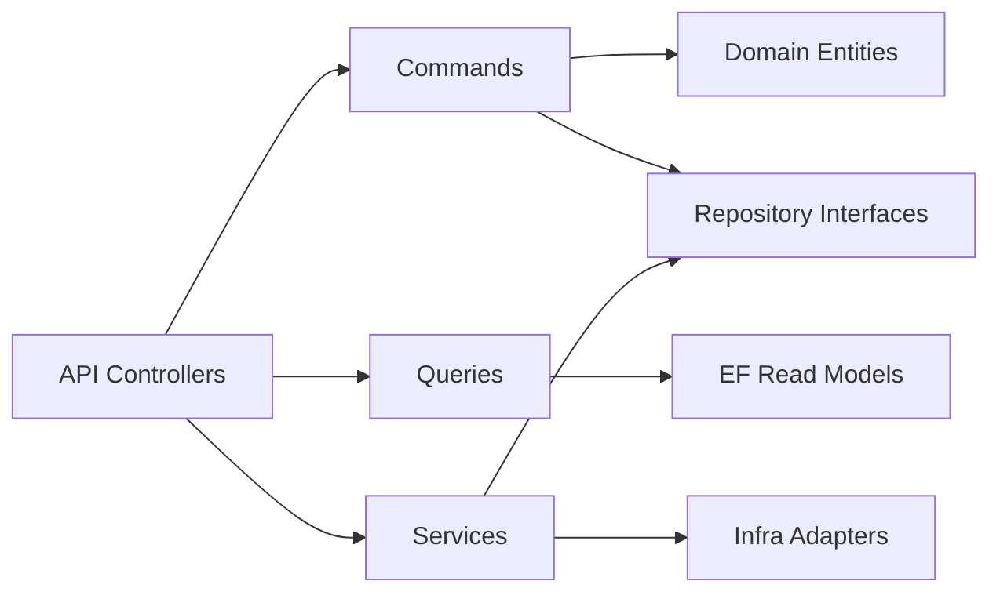
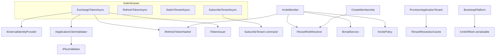

# IdPPlatform — Documentação da Camada Application

Documentação de referência do projeto `IdPPlatform.Application`: **services** (contratos e comportamento), **commands** e **queries** (use cases), com foco em conceito, aplicabilidade e fluxo lógico.

- Implementações de services e a maior parte das queries ficam em `IdPPlatform.Infrastructure`.
- Vários commands estão implementados diretamente em Application (regras de negócio + orquestração).
- Para entidades de domínio, veja [DOMAIN.md](DOMAIN.md).
- Para fluxos integrados e mapa mental, veja [ENTITY_AND_FLOW_GUIDE.md](../ENTITY_AND_FLOW_GUIDE.md).

Rotas HTTP citadas assumem API **v1** (`v{version}/...`).

---

## 1. Objetivo e mapa mental

A camada Application define **o que o sistema faz** em termos de casos de uso, sem detalhes de HTTP, EF ou Firebase:

| Bloco | Responsabilidade |
|-------|------------------|
| **Services** | Capacidades transversais reutilizáveis (auth, JWT, email, hash, escopo do usuário, cache, transação) |
| **Commands** | Operações que alteram estado (criar tenant, convidar, provisionar, bootstrap) |
| **Queries** | Leituras projetadas em DTOs (usuário, apps, tenants, auditoria) |
| **DTOs / Requests** | Contratos de entrada e saída dos use cases |

**Registro DI:** interfaces em Application; implementações em `Infrastructure/Extensions/ServiceExtensions.cs` e `ServiceCollectionExtensions.cs` (queries/use cases).

---

## 2. Services

Onze contratos principais em `Services/` (+ `IInvitePolicy` em `Interfaces/`). Todos são **scoped**, exceto caches e Firebase registrados como singleton na infraestrutura.

---

### 2.1 `IAuth` → `IdPAuth` (Infrastructure)

**Significado:** orquestrador do ciclo de vida de autenticação — login federado, refresh, troca de tenant, subscribe SaaS, logout e gestão de sessões.

**Integra com:** `IExternalIdentityProvider`, `IApplicationClientValidator`, `ITokenIssuer`, `IRefreshTokenHasher`, `IUnitOfWork`, repositórios de user/session/membership, `ISubscribeTenant`, `IUserScope`.

**Consumidor principal:** `AuthController` (`/v1/auth/*`).

#### `ExchangeTokenAsync(ExchangeTokenRequest, CancellationToken) → AuthResult`

**Aplicabilidade:** primeiro login após token de identidade externo (Firebase) + validação do client OAuth. Endpoint: `POST /v1/auth/exchange` (anônimo, rate limit).

**Fluxo:**

1. Garante que a plataforma foi bootstrapped (`EnsurePlatformBootstrapCompletedAsync`).
2. Valida client OAuth (`IApplicationClientValidator`) — id, secret, redirect, scopes, PKCE.
3. Valida token externo (`IExternalIdentityProvider`) → email e `providerUserId`.
4. Localiza ou cria `User` (display name = parte local do email).
5. Localiza ou cria `ExternalIdentity`.
6. Carrega memberships do usuário (com tenants e roles).
7. Cria `AuthSession` (sem tenant inicial), `RefreshToken` (hash), aplica limite de sessões ativas.
8. `SaveChangesAsync` → emite JWT + refresh bruto + lista de tenants via `BuildAuthResult`.

**Exceções:** `DomainBusinessRuleException` (plataforma não configurada), `InvalidClientException`, `UnauthorizedApplicationException`, validações de domínio na criação de entidades.

#### `RefreshTokenAsync(RefreshTokenRequest, CancellationToken) → AuthResult`

**Aplicabilidade:** renovar access token sem novo login. `POST /v1/auth/refresh`.

**Fluxo:** hash do refresh → busca com sessão; rejeita revogado/expirado/sessão inativa; revoga token atual; cria novo (rotação); `Touch` na sessão; `SaveChangesAsync` → `BuildAuthResult`.

#### `SwitchTenantAsync(SwitchTenantRequest, CancellationToken) → AuthResult`

**Aplicabilidade:** usuário autenticado escolhe tenant ativo na sessão atual. `POST /v1/auth/switch-tenant` (`[Authorize]`).

**Fluxo:**

1. Exige `IUserScope` autenticado com `UserId` e `SessionId`.
2. Valida membership ativa no `TenantId` solicitado.
3. `AuthSession.SwitchTenant` + save.
4. Emite **novo** refresh token (tokens antigos da sessão não são revogados aqui).
5. `BuildAuthResult` com claims de tenant atualizadas.

**Nota:** `SwitchTenantRequest.RefreshToken` existe no contrato mas **não é usado** na implementação atual.

#### `SubscribeTenantAsync(SubscribeTenantRequest, CancellationToken) → AuthResult`

**Aplicabilidade:** onboarding SaaS — cria tenant vinculado à `Application` da sessão OAuth (sem expor `applicationId` ao client). `POST /v1/auth/subscribe`.

**Fluxo:**

1. Mesmas exigências de escopo que switch tenant.
2. Delega provisionamento a `ISubscribeTenant.ExecuteAsync`.
3. `session.SwitchTenant` para o novo tenant/membership.
4. Novo refresh token + `BuildAuthResult`.

#### `LogoutAsync(string refreshToken, CancellationToken)`

**Aplicabilidade:** encerrar sessão. `POST /v1/auth/logout`.

**Fluxo:** hash → localiza refresh → revoga token e sessão pai → save.

#### `ListActiveSessionsAsync(Guid userId, CancellationToken) → IReadOnlyList<AuthSessionDto>`

**Aplicabilidade:** listar dispositivos/sessões do usuário. `GET /v1/auth/sessions`.

**Fluxo:** mapeia sessões ativas para DTO (ids, client, status, UA, IP, expiração, última atividade).

#### `RevokeSessionAsync(Guid userId, Guid sessionId, CancellationToken)`

**Aplicabilidade:** revogar sessão própria. `DELETE /v1/auth/sessions/{sessionId}`.

**Fluxo:** carrega sessão; proíbe se `session.UserId != userId`; revoga sessão e todos os refresh tokens ativos dela.

#### Helpers privados (`IdPAuth`)

| Helper | Função |
|--------|--------|
| `BuildAuthResult` | Resolve membership da sessão, roles de plataforma (`IsPlatformAdmin` → `prole`), chama `ITokenIssuer.Issue`, monta `AuthResult` e resumo de tenants |
| `EnforceSessionLimitAsync` | Se sessões ativas > `SessionOptions.MaxSessionsPerUser`, revoga a mais antiga |
| `EnsurePlatformBootstrapCompletedAsync` | Bloqueia exchange se plataforma não bootstrapped |

---

### 2.2 `ITokenIssuer` → `TokenIssuer`

**Significado:** emissão de access tokens JWT internos do IdP.

**Aplicabilidade:** chamado por `IdPAuth.BuildAuthResult` em todos os fluxos que retornam tokens.

#### `Issue(TokenClaims claims) → string`

**Fluxo:**

- Monta `JwtSecurityToken` com `JwtOptions` (issuer, audience, HMAC-SHA256, TTL em minutos).
- Claims: `sub`/`uid`, `sid`, `email`; opcional `tid`, `mid`; cada role de tenant em `trole` + `ClaimTypes.Role`; roles de plataforma via `PlatformRoleDefaults.ClaimType`; `amr`.
- Retorna JWT serializado (sem persistência).

**Contrato de leitura:** deve estar alinhado com `HttpUserScope` (mesmos nomes de claim).

---

### 2.3 `IExternalIdentityProvider` → `FirebaseIdentityProvider`

**Significado:** adaptador do provedor externo de identidade (hoje Firebase).

#### `ValidateAsync(string identityToken, CancellationToken) → ExternalAuthResult`

**Aplicabilidade:** exchange de login, aceite de convite, bootstrap da plataforma.

**Fluxo:**

1. `FirebaseAuth.VerifyIdTokenAsync`.
2. Falha → `UnauthorizedApplicationException`.
3. Exige claim `email` → senão unauthorized.
4. Retorna `Provider = "firebase"`, `ProviderUserId`, `Email`, `EmailVerified`, `AuthenticationMethods`.

---

### 2.4 `IApplicationClientValidator` → `ApplicationClientValidator`

**Significado:** validação do client OAuth no token exchange.

**Aplicabilidade:** apenas `IdPAuth.ExchangeTokenAsync`.

#### `ValidateAsync(clientId, clientSecret?, redirectUri?, requestedScopes, codeChallenge?, codeChallengeMethod?, CancellationToken) → ApplicationClient`

**Fluxo:**

1. Rejeita `clientId` vazio.
2. Carrega client; senão `InvalidClientException`.
3. **Secret:** ignorado para `Public`; confidencial exige match com `ClientSecretHash` (BCrypt se hash `$2*`, senão comparação literal).
4. **Redirect URI:** se informada, deve constar no JSON `RedirectUris` (normalização trim + sem `/` final).
5. **Scopes:** cada scope solicitado deve estar em `AllowedScopes`.
6. `IPkceValidator.ValidateForExchange` para clients públicos.
7. Retorna entidade `ApplicationClient` validada.

---

### 2.5 `IPkceValidator` → `PkceValidator`

**Significado:** regras PKCE no exchange para clients públicos.

#### `ValidateForExchange(ClientType, codeChallenge?, codeChallengeMethod?)`

**Fluxo:**

- No-op para clients não públicos.
- Público: `codeChallenge` obrigatório (43–128 chars); método default `S256`, aceita `S256` ou `PLAIN`.
- Violação → `InvalidClientException`.

**Limitação atual:** valida presença/formato do challenge; **não** verifica verifier contra challenge no exchange.

---

### 2.6 `ITenantRoleResolver` → `TenantRoleResolver`

**Significado:** resolve chaves de role (`owner`, `admin`, …) em entidades `TenantRole` ativas persistidas.

**Aplicabilidade:** `InviteMember`, `CreateMembership`, `UpdateMembershipRole`.

#### `ResolveActiveRolesAsync(Guid tenantId, IReadOnlyCollection<string> roleKeys, CancellationToken) → IReadOnlyList<TenantRole>`

**Fluxo:**

1. Rejeita lista vazia → `DomainValidationException`.
2. Normaliza para `TenantRoleKey`, deduplica; duplicata na entrada → erro.
3. Busca roles ativas do tenant por chaves.
4. Se faltar alguma chave → `DomainNotFoundException`.
5. Retorna na **ordem** das chaves de entrada.

**Complementa** (não substitui) `TenantRoleAssignmentRules` no domínio — este resolver opera em **chaves string** antes da persistência; o domínio valida entidades `TenantRole` em membership/invite.

---

### 2.7 `IRefreshTokenHasher` → `RefreshTokenHasher`

**Significado:** hashing determinístico para tokens sensíveis armazenados apenas como hash.

#### `Hash(string refreshToken) → string`

**Fluxo:** SHA-256 UTF-8 → hex uppercase. Usado para refresh tokens e tokens de convite.

**Aplicabilidade:** `IdPAuth`, `InviteMember`, `AcceptInvite`.

---

### 2.8 `IEmailService` → `AwsSesEmailService`

**Significado:** envio de e-mail transacional.

#### `SendInviteAsync(string toEmail, string tenantName, string inviteToken, CancellationToken)`

**Aplicabilidade:** após persistir `TenantInvite` em `InviteMember`.

**Fluxo:** e-mail texto simples com token bruto (sem template de link ainda); envia via AWS SES (`EmailOptions.FromAddress`).

---

### 2.9 `IUserScope` → `HttpUserScope`

**Significado:** leitura do usuário autenticado a partir do JWT no `HttpContext` atual.

**Aplicabilidade:** controllers, `IdPAuth` (switch/subscribe), `AuditInterceptor`, queries com checagem de autorização.

| Membro | Descrição |
|--------|-----------|
| `IsAuthenticated` | Identidade autenticada no request |
| `UserId` | Claim `uid` |
| `SessionId` | Claim `sid` |
| `TenantId` / `MembershipId` | Claims `tid` / `mid` |
| `TenantRoles` | Todas as claims `trole`, normalizadas |
| `PlatformRoles` | Claims `PlatformRoleDefaults.ClaimType` |

#### `HasAnyTenantRole(params string[] roleKeys) → bool`

Comparação case-insensitive com roles do JWT.

#### `HasAnyPlatformRole(params string[] roleKeys) → bool`

Idem para roles de plataforma.

---

### 2.10 `IUnitOfWork` → `UnitOfWork`

**Significado:** unidade de trabalho sobre `ApplicationDbContext`.

#### `SaveChangesAsync(CancellationToken)`

Persiste alterações rastreadas pelo EF (padrão em commands e `IdPAuth`).

#### `ExecuteInSerializableTransactionAsync(Func<CancellationToken, Task>, CancellationToken)`

**Aplicabilidade:** operações concorrentes críticas (`BootstrapPlatform`).

**Fluxo:** inicia transação → `SET TRANSACTION ISOLATION LEVEL SERIALIZABLE` → executa delegate → commit. **Não** chama `SaveChanges` automaticamente — o caller deve salvar dentro do delegate.

---

### 2.11 `ITenantResolutionCache` → `DistributedTenantResolutionCache`

**Significado:** invalidação de cache de resolução de tenant (middleware de tenancy).

#### `InvalidateByIdentifierAsync(string identifier, CancellationToken)`

**Aplicabilidade:** após criar/atualizar/provisionar tenant (`CreateTenant`, `UpdateTenant`, `ProvisionApplicationTenant`, `SubscribeTenant`).

**Fluxo:** remove chave `tenant:identifier:{tenantKey}` no `IDistributedCache` (Redis ou memória).

**Leitura:** `TenantStore` na infraestrutura popula o cache; este service só invalida.

---

### 2.12 `IInvitePolicy` → `InvitePolicy` (interface em `Interfaces/`)

**Significado:** política de expiração de convites.

| Membro | Descrição |
|--------|-----------|
| `ExpirationHours` | Horas até expirar; de `InviteOptions`, default **72** se ≤ 0 |

**Aplicabilidade:** `InviteMember` define `TenantInvite.ExpiresAt = UtcNow.AddHours(ExpirationHours)`.

---

## 3. Commands (use cases de escrita)

Commands alteram agregados via repositórios + `IUnitOfWork`. Autorização pode estar no **controller** (policy JWT), no **use case** (`ActorPlatformRoles`, membership) ou em **ambos**.

---

### 3.1 Application — `CreateApplication`

| | |
|---|---|
| **Interface** | `ICreateApplication` |
| **Implementação** | Application |
| **Retorno** | `Task<Guid>` |
| **Endpoint** | `POST /v1/applications` — policy `PlatformAdministrator` |

**Conceito:** registrar nova aplicação consumidora global no IdP.

**Fluxo:** `new Application(name, slug, type)` → `IApplicationRepository.AddAsync` → `SaveChangesAsync` → id.

**Exceções:** `DomainValidationException` (nome/slug).

---

### 3.2 Application — `CreateApplicationClient`

| | |
|---|---|
| **Endpoint** | `POST /v1/applications/{applicationId}/clients` — `[Authorize]` |

**Conceito:** credencial OAuth (client id, secret hash, tipo, URIs, scopes, TTL).

**Fluxo:**

1. Exige `ActorPlatformRoles` com chave administrativa de plataforma.
2. Cria `ApplicationClient` (listas JSON para URIs/scopes).
3. Persiste → retorna id do client.

**Exceções:** `ForbiddenApplicationException`; validações de `ApplicationClient`.

---

### 3.3 Application — `ProvisionApplicationTenant`

| | |
|---|---|
| **Endpoint** | `POST /v1/applications/{applicationId}/tenants/provision` — `PlatformAdministrator` |
| **Retorno** | `ProvisionApplicationTenantResult` |

**Conceito:** provisionamento **operado pela plataforma** — cria tenant, roles sistema, membership owner, vínculo `ApplicationTenant` com metadados opcionais.

**Fluxo:**

1. Platform admin.
2. Carrega application; valida unicidade de `TenantKey`.
3. Resolve administrador inicial (`InitialAdministratorUserId` ou actor); usuário ativo.
4. Cria `Tenant`, roles de `TenantRoleDefaults.All`, membership owner.
5. Cria `ApplicationTenant` (`ExternalCustomerId`, `PlanCode`); verifica duplicidade app↔tenant.
6. Save + invalidação de cache de tenant.

**Exceções:** forbidden, not found, key duplicada, usuário inativo, mapping existente, owner role ausente.

---

### 3.4 Tenant — `CreateTenant`

| | |
|---|---|
| **Endpoint** | `POST /v1/tenants` — `PlatformAdministrator` |

**Conceito:** criar tenant **sem** vínculo imediato a uma application (governança global).

**Fluxo:** igual provisionamento parcial (tenant + roles + owner membership), sem `ApplicationTenant`.

---

### 3.5 Tenant — `UpdateTenant`

| | |
|---|---|
| **Endpoint** | `PATCH /v1/tenants/{id}` |

**Conceito:** renomear tenant.

**Fluxo:**

1. Platform admin **ou** membership ativo no tenant com role em `TenantRoleDefaults.AdministrativeKeys`.
2. `tenant.UpdateName` → save → invalida cache.

**Exceções:** `ForbiddenApplicationException`, tenant não encontrado.

---

### 3.6 Tenant — `InviteMember`

| | |
|---|---|
| **Endpoint** | `POST /v1/tenants/{id}/invites` |

**Conceito:** convite por e-mail com roles pré-atribuídas.

**Fluxo:**

1. Mesma autorização que `UpdateTenant`.
2. `ITenantRoleResolver` para roles do convite.
3. Token aleatório 64 bytes → hash → `TenantInvite` com expiração (`IInvitePolicy`).
4. Persiste → `IEmailService.SendInviteAsync`.

**Exceções:** forbidden, tenant não encontrado, erros do resolver e do domínio em `TenantInvite`.

---

### 3.7 Tenant — `AcceptInvite`

| | |
|---|---|
| **Endpoint** | `POST /v1/invites/accept` — `[AllowAnonymous]` |

**Conceito:** aceitar convite com token bruto + identity token externo.

**Fluxo:**

1. Hash do token → busca convite com roles.
2. Valida não consumido / não expirado.
3. `IExternalIdentityProvider` — email deve coincidir com o convite.
4. Cria ou localiza `User`.
5. Cria `TenantMembership` ou `MergeRoles` se já existir membership ativa.
6. `invite.Consume()` → save → retorna `membership.Id`.

**Exceções:** convite não encontrado, consumido, expirado, email mismatch, regras de membership.

---

### 3.8 Membership — `CreateMembership`

| | |
|---|---|
| **Endpoint** | `POST /v1/tenants/{tenantId}/memberships` |

**Conceito:** adicionar usuário existente ao tenant com roles.

**Fluxo:**

1. Se membership ativa já existe → erro de negócio.
2. `ITenantRoleResolver` → `TenantMembership` → save.

**Autorização:** apenas `[Authorize]` no controller (sem checagem de tenant no use case).

---

### 3.9 Membership — `UpdateMembershipRole`

| | |
|---|---|
| **Endpoint** | `PATCH /v1/memberships/{id}` |

**Conceito:** substituir conjunto de roles de uma membership.

**Fluxo:** carrega membership com roles → resolver → `ReplaceRoles` → save.

**Exceções:** membership não encontrada, revogada (`CannotChangeRevokedMembershipRoles`).

---

### 3.10 Membership — `RevokeMembership`

| | |
|---|---|
| **Endpoint** | `DELETE /v1/memberships/{id}` |

**Conceito:** revogar acesso do usuário ao tenant (`IsActive = false`).

**Fluxo:** carrega membership → `Revoke()` → save.

---

### 3.11 TenantRole — `CreateTenantRole`

| | |
|---|---|
| **Endpoint** | `POST /v1/tenants/{tenantId}/roles` |

**Conceito:** role customizada além das roles de sistema.

**Fluxo:** confirma tenant → unicidade de chave → `TenantRole` custom → save.

---

### 3.12 TenantRole — `UpdateTenantRole`

| | |
|---|---|
| **Endpoint** | `PATCH /v1/tenantroles/{id}` |

**Conceito:** atualizar nome/descrição e ativar/desativar role.

**Fluxo:** `UpdateDetails` + `Activate`/`Deactivate` conforme flag → save.

---

### 3.13 User — `CreateUser`

| | |
|---|---|
| **Endpoint** | **Nenhum** (registrado em DI; criação usual via `IdPAuth`, `AcceptInvite`, `BootstrapPlatform`) |

**Conceito:** criar usuário interno com email e perfil.

**Fluxo:** verifica email duplicado → `new User` → save → id.

---

### 3.14 User — `UpdateUser`

| | |
|---|---|
| **Endpoint** | `PATCH /v1/users/me` |

**Conceito:** atualizar perfil do usuário autenticado.

**Fluxo:** `GetForUpdateAsync` → `UpdateProfile(displayName, photoUrl)` → save.

**Nota:** `PhotoUrl` passa pelo value object `PhotoUrl` (URL http/https ou null).

---

### 3.15 User — `LinkExternalIdentity`

| | |
|---|---|
| **Endpoint** | **Nenhum** (lógica similar embutida em `IdPAuth` / bootstrap) |

**Conceito:** vincular provedor externo a usuário existente.

**Fluxo:** busca por provider + providerUserId → se existe, retorna (idempotente); senão cria `ExternalIdentity` → save.

---

### 3.16 Infrastructure — `BootstrapPlatform`

| | |
|---|---|
| **Endpoint** | `POST /v1/platform/bootstrap` — anônimo, rate limit |

**Conceito:** configuração **única** da instância IdP (admin, tenant raiz, app, client OAuth, `PlatformConfiguration`).

**Fluxo** (transação serializável):

1. Bloqueia se já bootstrapped ou já existe platform admin.
2. Valida unicidade: tenant key, application slug, OAuth clientId.
3. Valida parâmetros (TTL, URIs, scopes, secret).
4. Valida identity token; cria/obtém user; `PromoteToPlatformAdministrator`.
5. Link `ExternalIdentity` se necessário.
6. Tenant + roles sistema + membership owner.
7. Application + ApplicationClient (BCrypt do secret se confidencial).
8. `PlatformConfiguration.MarkBootstrapped`.
9. `AuditLog` ação `PlatformBootstrapped` → save.
10. Retorna DTO com IDs criados.

---

### 3.17 Infrastructure — `SubscribeTenant`

| | |
|---|---|
| **Endpoint** | `POST /v1/auth/subscribe` (via `IAuth.SubscribeTenantAsync`) |

**Conceito:** provisionamento **self-service** pelo usuário autenticado na application da sessão OAuth.

**Fluxo:**

1. Valida sessão (`ActorUserId`, `ClientId` na sessão).
2. Resolve `ApplicationClient` → `Application`.
3. Mesmo núcleo de `ProvisionApplicationTenant`, com admin = usuário da sessão (sem platform admin).
4. Save + invalidação de cache.

**Exceções:** sessão inválida, forbidden, client inválido, mesmas de provisionamento.

---

## 4. Queries (use cases de leitura)

Queries usam EF `AsNoTracking` em Infrastructure, projetam DTOs e **não** alteram estado.

---

### 4.1 User — `GetUserById`

| | |
|---|---|
| **Endpoint** | `GET /v1/users/me` |
| **Retorno** | `UserDto?` |

**Conceito:** perfil do usuário com memberships ativas e role keys.

**Fluxo:** includes memberships → tenant → roles; filtra `IsActive`; mapeia `PhotoUrl`, email, displayName.

**Exceções:** nenhuma (controller retorna 404 se null).

---

### 4.2 User — `GetUserByEmail`

| | |
|---|---|
| **Endpoint** | **Nenhum** |

**Conceito:** mesmo que `GetUserById`, filtro por email normalizado.

---

### 4.3 User — `ListUserMemberships`

| | |
|---|---|
| **Endpoint** | `GET /v1/users/me/memberships` |
| **Retorno** | `PagedResult<UserMembershipDto>` |

**Conceito:** listagem paginada de memberships ativas do usuário (ordenado por nome do tenant).

---

### 4.4 Application — `ListApplications`

| | |
|---|---|
| **Endpoint** | `GET /v1/applications` |

**Conceito:** catálogo paginado de applications (`Id`, `Name`, `Slug`, `Type`).

---

### 4.5 Application — `GetApplicationById`

| | |
|---|---|
| **Endpoint** | `GET /v1/applications/{id}` |

**Conceito:** detalhe de uma application ou null.

---

### 4.6 Tenant — `ListTenantsByUser`

| | |
|---|---|
| **Endpoint** | `GET /v1/tenants` (userId = usuário autenticado) |

**Conceito:** tenants onde o usuário tem membership ativa, paginado.

---

### 4.7 Tenant — `GetTenantById`

| | |
|---|---|
| **Endpoint** | `GET /v1/tenants/{id}` |

**Conceito:** detalhe de tenant com **autorização na query**.

**Fluxo:**

1. Platform admin **ou** membership ativo com role administrativa no tenant.
2. Se não autorizado → retorna `null` (API responde 404, não 403).
3. Senão projeta tenant.

---

### 4.8 TenantRole — `ListTenantRoles`

| | |
|---|---|
| **Endpoint** | `GET /v1/tenants/{tenantId}/roles` |

**Conceito:** roles do tenant (opcional incluir inativas), paginado em memória após repositório.

---

### 4.9 Membership — `ListMembershipsByTenant`

| | |
|---|---|
| **Endpoint** | `GET /v1/tenants/{tenantId}/memberships` |

**Conceito:** todas memberships do tenant (ativas e revogadas) com role keys, paginado.

---

### 4.10 AuditLogs — `ListAuditLogs`

| | |
|---|---|
| **Endpoint** | `GET /v1/auditlogs` |

**Conceito:** trilha de auditoria tenant-scoped.

**Autorização:** controller exige `owner` ou `admin` no tenant (`IUserScope.HasAnyTenantRole`) antes da query.

**Fluxo:** filtros opcionais (userId, action, resourceType, período) → ordenação desc por `CreatedAt` → página.

---

### 4.11 Platform — `GetPlatformStatus`

| | |
|---|---|
| **Endpoint** | `GET /v1/platform/status` — anônimo |

**Conceito:** estado de configuração da instância para UI de setup.

**Fluxo:**

1. Lê `PlatformConfiguration`.
2. Verifica existência de usuário `IsPlatformAdmin`.
3. `IsConfigured` = bootstrapped + root user + admin; expõe `RequiresBootstrap` e `OauthClientId` se aplicável.

---

## 5. Tabela rápida — endpoint × use case

| Use case | HTTP |
|----------|------|
| CreateApplication | `POST /applications` |
| CreateApplicationClient | `POST /applications/{id}/clients` |
| ProvisionApplicationTenant | `POST /applications/{id}/tenants/provision` |
| CreateTenant | `POST /tenants` |
| UpdateTenant | `PATCH /tenants/{id}` |
| InviteMember | `POST /tenants/{id}/invites` |
| AcceptInvite | `POST /invites/accept` |
| CreateMembership | `POST /tenants/{tenantId}/memberships` |
| UpdateMembershipRole | `PATCH /memberships/{id}` |
| RevokeMembership | `DELETE /memberships/{id}` |
| CreateTenantRole | `POST /tenants/{tenantId}/roles` |
| UpdateTenantRole | `PATCH /tenantroles/{id}` |
| CreateUser | — |
| UpdateUser | `PATCH /users/me` |
| LinkExternalIdentity | — |
| BootstrapPlatform | `POST /platform/bootstrap` |
| SubscribeTenant | `POST /auth/subscribe` |
| GetUserById | `GET /users/me` |
| GetUserByEmail | — |
| ListUserMemberships | `GET /users/me/memberships` |
| ListApplications | `GET /applications` |
| GetApplicationById | `GET /applications/{id}` |
| ListTenantsByUser | `GET /tenants` |
| GetTenantById | `GET /tenants/{id}` |
| ListTenantRoles | `GET /tenants/{tenantId}/roles` |
| ListMembershipsByTenant | `GET /tenants/{tenantId}/memberships` |
| ListAuditLogs | `GET /auditlogs` |
| GetPlatformStatus | `GET /platform/status` |

**Auth (service, não command):** `POST /auth/exchange`, `/refresh`, `/switch-tenant`, `/subscribe`, `/logout`, `GET /auth/sessions`, `DELETE /auth/sessions/{id}`.

---

## 6. Integração services × use cases

---

## 7. Observações transversais

- **Autorização em camadas:** policies no controller (`PlatformAdministrator`), `IUserScope` nos controllers/handlers, checagens explícitas em commands (`ActorPlatformRoles`, membership administrativa) e em queries (`GetTenantById`).
- **Use cases sem endpoint:** `CreateUser`, `LinkExternalIdentity`, `GetUserByEmail` — disponíveis para reutilização ou endpoints futuros.
- **Dupla validação de roles:** `ITenantRoleResolver` (chaves → entidades ativas) + `TenantRoleAssignmentRules` no domínio (invariantes em membership/invite).
- **DTOs:** agrupados por recurso em `UseCases/*/Dtos` e `Services/Auth/*` para resultados de autenticação.

---

## 8. Índice de pastas (`IdPPlatform.Application`)

| Pasta | Conteúdo |
|-------|----------|
| `Services/Auth/` | `IAuth`, requests, `AuthResult`, DTOs de sessão |
| `Services/TokenIssuer/` | `ITokenIssuer`, `TokenClaims` |
| `Services/ExternalIdentityProvider/` | `IExternalIdentityProvider`, `ExternalAuthResult` |
| `Services/ApplicationClient/` | `IApplicationClientValidator`, `IPkceValidator` |
| `Services/TenantRoles/` | `ITenantRoleResolver` |
| `Services/RefreshTokenHasher/` | `IRefreshTokenHasher` |
| `Services/Email/` | `IEmailService` |
| `Services/UserScope/` | `IUserScope` |
| `Services/UnitOfWork/` | `IUnitOfWork` |
| `Services/TenantResolutionCache/` | `ITenantResolutionCache` |
| `Interfaces/` | `IInvitePolicy` |
| `UseCases/*/` | Commands, queries (interfaces), requests, DTOs |
| `Exceptions/` | `ApplicationErrorMessages`, exceções de aplicação |

Implementações correspondentes: `IdPPlatform.Infrastructure/Services/*`, `Infrastructure/Queries/*`, `Infrastructure/UseCases/*`.
