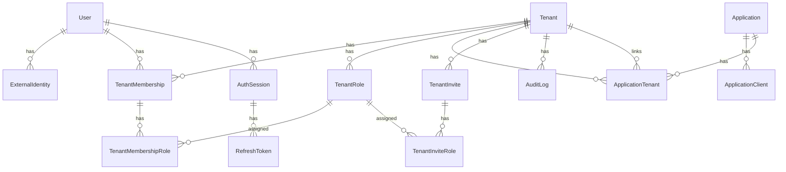
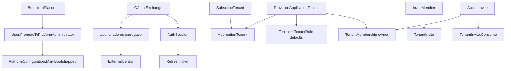

# IdPPlatform — Documentação do Domínio

Documentação de referência do projeto `IdPPlatform.Domain`: entidades, value objects, regras de negócio, métodos e relacionamentos.

Para fluxos HTTP, veja [ENTITY_AND_FLOW_GUIDE.md](../ENTITY_AND_FLOW_GUIDE.md). Para services, commands e queries da camada Application, veja [APPLICATION.md](APPLICATION.md). Visão de produto: [PRODUCT_DOCUMENTATION.md](../PRODUCT_DOCUMENTATION.md).

---

## 1. Visão e bounded context

O domínio modela um **Identity Provider (IdP) multi-tenant** que:

- Mantém identidade canônica interna (`User`) vinculada a provedores externos (`ExternalIdentity`).
- Isola organizações em `Tenant`, com papéis configuráveis (`TenantRole`) e vínculos de usuário (`TenantMembership`).
- Registra aplicações consumidoras (`Application`, `ApplicationClient`) e o vínculo comercial/técnico app↔tenant (`ApplicationTenant`).
- Gerencia sessões OAuth (`AuthSession`, `RefreshToken`), convites (`TenantInvite`) e auditoria (`AuditLog`).
- Controla bootstrap único da plataforma (`PlatformConfiguration`, `User.IsPlatformAdmin`).

Dois níveis de autorização coexistem:

| Nível | Onde vive | Efeito típico |
|-------|-----------|---------------|
| **Plataforma** | `User.IsPlatformAdmin` | Claim JWT `prole=plat_admin`; operações globais (criar app, provisionar tenant) |
| **Tenant** | `TenantMembership` + `TenantRole` | Claims `tid`, `mid`, `trole`; operações dentro de um tenant |

---

## 2. Hierarquia base

### 2.1 `BaseEntity`

Raiz de todas as entidades persistentes.

| Propriedade | Descrição |
|-------------|-----------|
| `Id` | `Guid`, gerado no construtor |
| `CreatedAt` / `UpdatedAt` | UTC; preenchidos pela infraestrutura via interceptors |

| Método | Lógica |
|--------|--------|
| `SetCreatedAt()` | Define `CreatedAt` e `UpdatedAt` para `DateTime.UtcNow` |
| `SetUpdatedAt()` | Atualiza apenas `UpdatedAt` |

### 2.2 `TenantEntity` : `BaseEntity`, `ITenantScoped`

Entidades com escopo de tenant obrigatório.

| Propriedade | Descrição |
|-------------|-----------|
| `TenantId` | FK lógica para `Tenant` |

| Construtor | Lógica |
|------------|--------|
| `TenantEntity(Guid tenantId)` | Se `tenantId == Guid.Empty` → `DomainValidationException` (`TenantEntity.TenantIdRequired`) |

### 2.3 `ITenantScoped`

Marca entidades filtráveis por tenant na camada de aplicação/infraestrutura.

---

## 3. Value Objects

Padrão comum: `sealed record`, construtor privado para EF, validação no construtor público, conversões implícitas com `string`.

### 3.1 `EmailAddress`

Email normalizado do usuário ou convite.

| Regra | Detalhe |
|-------|---------|
| Obrigatório | Não aceita null/whitespace |
| Normalização | `Trim` + `ToLowerInvariant` |
| Tamanho | Máx. 255 caracteres |
| Formato | Validação via `MailAddress` |

| API | Comportamento |
|-----|---------------|
| `EmailAddress(string email)` | Valida e atribui `Value` |
| `implicit operator string` | Retorna `Value` |
| `implicit operator EmailAddress` | Cria a partir de `string` |

**Exceções:** `DomainErrorMessages.EmailAddress.*`

### 3.2 `TenantKey`

Chave estável e única de um tenant (slug).

| Regra | Detalhe |
|-------|---------|
| Formato | Regex `^[a-z0-9][a-z0-9-]{1,62}$` após normalização |
| Normalização | `Trim` + `ToLowerInvariant` |

**Exceções:** `DomainErrorMessages.TenantKey.*`

### 3.3 `TenantRoleKey`

Chave estável de uma role dentro do tenant (ex.: `owner`, `admin`).

Mesmas regras de formato que `TenantKey`.

**Exceções:** `DomainErrorMessages.TenantRole.KeyRequired`, `KeyInvalidFormat`

### 3.4 `PhotoUrl`

URL absoluta da foto de perfil do usuário (opcional).

| Regra | Detalhe |
|-------|---------|
| Opcional | `FromNullable` / conversão implícita de `string?` retorna `null` para whitespace |
| Formato | URI absoluta com esquema `http` ou `https` |
| Tamanho | Máx. 500 caracteres (`PhotoUrl.MaxLength`) |

| API | Comportamento |
|-----|---------------|
| `PhotoUrl(string url)` | Valida URL não vazia |
| `FromNullable(string? url)` | `null` se vazio; senão valida |
| `implicit operator string?` | Retorna `Value` ou `null` |
| `implicit operator PhotoUrl?` | Delega a `FromNullable` |

**Exceções:** `DomainErrorMessages.PhotoUrl.*`

Persistência: `OwnsOne` em `User`, coluna `photo_url`.

---

## 4. Regras de domínio compartilhadas

### 4.1 `TenantRoleAssignmentRules.ValidateForTenant`

Centraliza validação de coleções de `TenantRole` usadas em membership e convites.

| Entrada | Saída |
|---------|-------|
| `tenantId`, `IEnumerable<TenantRole>? roles` | `IReadOnlyList<TenantRole>` validada |

| Invariante | Exceção |
|------------|---------|
| Pelo menos uma role | `AtLeastOneRoleRequired` |
| Toda role pertence ao `tenantId` | `RoleTenantMismatch` |
| Toda role está ativa | `InactiveRole` |
| Sem duplicatas por `Id` | `DuplicateRole` |

**Chamadores:** `TenantMembership.ReplaceRoles`, `TenantMembership.MergeRoles`, `TenantInvite.ReplaceRoles`.

---

## 5. Entidades

### 5.1 `User`

Identidade interna canônica no IdP.

| Propriedade | Descrição |
|-------------|-----------|
| `Email` | `EmailAddress`, único |
| `DisplayName` | Nome de exibição |
| `PhotoUrl` | `PhotoUrl?`, opcional |
| `IsActive` | `true` na criação |
| `IsPlatformAdmin` | Admin global; ver método de promoção |
| `ExternalIdentities` | Provedores externos vinculados |
| `Memberships` | Vínculos com tenants |

#### `User(EmailAddress email, string displayName, string? photoUrl = null)`

- Valida `displayName` não vazio.
- Define `IsActive = true`, `IsPlatformAdmin = false`.
- Converte `photoUrl` via VO (whitespace → `null`).

**Exceções:** `User.DisplayNameRequired`, erros de `PhotoUrl` se URL inválida.

#### `UpdateProfile(string displayName, string? photoUrl)`

- Substitui nome e foto (mesmas regras do construtor).
- Não altera email, `IsActive` nem `IsPlatformAdmin`.

#### `PromoteToPlatformAdministrator()`

- Define `IsPlatformAdmin = true`.
- **Único caminho no sistema:** bootstrap (`BootstrapPlatform` após `POST /v1/platform/bootstrap`).
- Sem revogação no domínio; banco impõe no máximo um admin (`IX_users_single_platform_admin`).
- Runtime: claim JWT `prole=plat_admin`.

---

### 5.2 `ExternalIdentity`

Vínculo entre `User` e provedor externo (ex.: Firebase).

| Propriedade | Descrição |
|-------------|-----------|
| `UserId` | Dono da identidade |
| `Provider` | Nome normalizado (`ToLowerInvariant`) |
| `ProviderUserId` | ID no provedor |
| `Email` | Email reportado pelo provedor |

#### `ExternalIdentity(Guid userId, string provider, string providerUserId, string email)`

- Rejeita `userId` vazio ou provider/ids vazios.
- Cria `EmailAddress` a partir de `email`.

**Exceções:** `ExternalIdentity.UserIdRequired`, `ProviderDataRequired`, erros de email.

---

### 5.3 `Tenant`

Unidade organizacional (empresa, workspace).

| Propriedade | Descrição |
|-------------|-----------|
| `Name` | Nome legível |
| `Key` | `TenantKey` único globalmente |
| `IsActive` | `true` na criação |
| `Memberships`, `Roles`, `Applications` | Coleções de navegação |

#### `Tenant(string name, TenantKey key)`

- Valida nome não vazio.
- `IsActive = true`.

#### `UpdateName(string name)`

- Atualiza nome com trim; rejeita vazio.

**Exceções:** `Tenant.NameRequired`

---

### 5.4 `TenantRole` : `TenantEntity`

Papel configurável dentro de um tenant.

| Propriedade | Descrição |
|-------------|-----------|
| `Key` | `TenantRoleKey` estável |
| `Name` / `Description` | Rótulos humanos |
| `IsSystem` | Role criada pelo sistema (defaults) |
| `IsActive` | Pode ser desativada sem apagar histórico |

#### `TenantRole(Guid tenantId, TenantRoleKey key, string name, string? description = null, bool isSystem = false)`

- Chama `SetDetails`; `IsActive = true`.

#### `UpdateDetails(string name, string? description)`

- Delega a `SetDetails`.

#### `Activate()` / `Deactivate()`

- Alternam `IsActive`.

#### `SetDetails` (privado)

- Nome obrigatório, máx. 120 chars; descrição opcional, máx. 500.

**Exceções:** `TenantRole.NameRequired`, `NameMaxLength`, `DescriptionMaxLength`

---

### 5.5 `TenantMembership` : `TenantEntity`

Permissão de um usuário em um tenant.

| Propriedade | Descrição |
|-------------|-----------|
| `UserId` | Usuário membro |
| `IsActive` | `false` após revogação |
| `JoinedAt` | UTC na criação |
| `Roles` | `TenantMembershipRole` (N:N com `TenantRole`) |

#### `TenantMembership(Guid tenantId, Guid userId, IEnumerable<TenantRole> roles)`

- Valida `userId`.
- `IsActive = true`, `JoinedAt = UtcNow`.
- Chama `ReplaceRoles(roles)`.

#### `ReplaceRoles(IEnumerable<TenantRole> roles)`

- Se membership revogada → `DomainBusinessRuleException` (`CannotChangeRevokedMembershipRoles`).
- Valida roles via `TenantRoleAssignmentRules`.
- Substitui coleção `Roles` por novas junções `TenantMembershipRole`.

#### `MergeRoles(IEnumerable<TenantRole> roles)`

- Mesma guarda de membership ativa.
- Adiciona roles validadas que ainda não existem (por `RoleId`).

#### `Revoke()`

- `IsActive = false`; não remove registros de roles.

---

### 5.6 `TenantMembershipRole` : `TenantEntity`

Junção membership ↔ role.

#### `TenantMembershipRole(Guid tenantId, Guid membershipId, TenantRole role)`

- Valida `membershipId` e que `role.TenantId == tenantId`.

**Exceções:** `TenantMembership.MembershipNotFound`, `TenantRole.RoleTenantMismatch`

---

### 5.7 `TenantInvite` : `TenantEntity`

Convite para entrada em um tenant.

| Propriedade | Descrição |
|-------------|-----------|
| `Email` | Destinatário |
| `TokenHash` | Hash do token (nunca o token bruto) |
| `ExpiresAt` | Validade |
| `ConsumedAt` | Preenchido no aceite |
| `InvitedByUserId` | Quem convidou |
| `Roles` | Roles concedidas no aceite |

#### `TenantInvite(...)`

- Valida `invitedByUserId` e `tokenHash`.
- Cria `EmailAddress`; chama `ReplaceRoles`.

#### `IsExpired()` / `IsConsumed()`

- Compara `ExpiresAt` com UTC agora; verifica `ConsumedAt`.

#### `Consume()`

- Idempotente: se já consumido, retorna; senão `ConsumedAt = UtcNow`.

#### `ReplaceRoles(IEnumerable<TenantRole> roles)`

- Valida via `TenantRoleAssignmentRules`; recria `TenantInviteRole`.

---

### 5.8 `TenantInviteRole` : `TenantEntity`

Junção convite ↔ role. Mesma lógica de tenant que `TenantMembershipRole`.

#### `TenantInviteRole(Guid tenantId, Guid inviteId, TenantRole role)`

**Exceções:** `TenantInvite.InviteNotFound`, `TenantRole.RoleTenantMismatch`

---

### 5.9 `Application`

Sistema consumidor registrado no IdP (CRM, app mobile, etc.).

| Propriedade | Descrição |
|-------------|-----------|
| `Name` / `Slug` | Identificação humana e técnica (`slug` em minúsculas) |
| `Type` | `ApplicationType` (Web, Mobile, Backend) |
| `Clients` | OAuth clients |
| `Tenants` | Vínculos via `ApplicationTenant` |

#### `Application(string name, string slug, ApplicationType type)`

- Nome e slug obrigatórios; slug normalizado.

**Exceções:** `Application.NameAndSlugRequired`

---

### 5.10 `ApplicationClient`

Credencial OAuth de uma aplicação.

| Propriedade | Descrição |
|-------------|-----------|
| `ApplicationId` | App dona |
| `ClientId` | Identificador público OAuth |
| `ClientSecretHash` | Hash do secret (clients confidenciais) |
| `ClientType` | Public ou Confidential |
| `RedirectUris` / `AllowedScopes` | JSON em string (default `[]`) |
| `AccessTokenTtlSeconds` | TTL; default 900 se ≤ 0 |

#### `ApplicationClient(...)`

- Valida `applicationId` e `clientId`.
- Normaliza URIs/scopes; aplica TTL padrão.

**Exceções:** `ApplicationClient.DataInvalid`

---

### 5.11 `ApplicationTenant`

Vínculo entre uma `Application` e um `Tenant`.

| Propriedade | Descrição |
|-------------|-----------|
| `ApplicationId` / `TenantId` | Chaves do relacionamento |
| `ExternalCustomerId` | ID do cliente no sistema da app consumidora (opcional) |
| `PlanCode` | Código de plano comercial (opcional) |
| `IsActive` | `true` na criação |

Metadados `ExternalCustomerId` e `PlanCode` **não alteram autorização** no IdP; servem para billing, onboarding e correlação com sistemas externos. Preenchidos em provision e subscribe.

#### `ApplicationTenant(Guid applicationId, Guid tenantId, string? externalCustomerId, string? planCode)`

- Rejeita GUIDs vazios.
- Trim em metadados; whitespace → `null`.
- `IsActive = true`.

**Exceções:** `ApplicationTenant.DataInvalid`

---

### 5.12 `AuthSession`

Sessão autenticada de um usuário.

| Propriedade | Descrição |
|-------------|-----------|
| `UserId` | Usuário da sessão |
| `ClientId` | Client OAuth que iniciou (opcional) |
| `TenantId` / `MembershipId` | Contexto tenant atual (opcional até switch) |
| `Status` | `SessionStatus` |
| `UserAgent` / `IpAddress` | Metadados |
| `ExpiresAt` / `LastActivityAt` | Controle temporal |

#### `AuthSession(...)`

- `Status = Active`; `LastActivityAt = UtcNow`.

#### `Touch()`

- Atualiza `LastActivityAt`.

#### `SwitchTenant(Guid tenantId, Guid membershipId)`

- Valida GUIDs; atualiza contexto e `Touch()`.

#### `Revoke()`

- `Status = Revoked`.

**Exceções:** `AuthSession.UserIdRequired`, `TenantContextInvalid`

---

### 5.13 `RefreshToken`

Renovação de sessão (apenas hash persistido).

| Propriedade | Descrição |
|-------------|-----------|
| `SessionId` | Sessão pai |
| `TokenHash` | Hash do refresh token |
| `ExpiresAt` | Expiração |
| `RevokedAt` | Revogação |
| `IsRevoked` | Calculado |

#### `RefreshToken(Guid sessionId, string tokenHash, DateTime expiresAt)`

#### `Revoke()`

- Idempotente; define `RevokedAt`.

**Exceções:** `RefreshToken.DataInvalid`

---

### 5.14 `AuditLog` : `TenantEntity`

Registro forense de ação sensível.

| Propriedade | Descrição |
|-------------|-----------|
| `UserId` / `MembershipId` | Ator (opcional) |
| `Action` | Nome da ação |
| `ResourceType` / `ResourceId` | Recurso afetado |
| `IpAddress` / `UserAgent` | Contexto de rede |

#### `AuditLog(...)`

- Apenas atribuição; sem validação extra no domínio (criado pelo interceptor).

---

### 5.15 `PlatformConfiguration`

Estado global do bootstrap da plataforma.

| Propriedade | Descrição |
|-------------|-----------|
| `IsBootstrapped` | Se o bootstrap já ocorreu |
| `RootUserId` | Primeiro admin |
| `OauthClientId` | Client da console/admin |
| `BootstrappedAt` | Timestamp |

#### `PlatformConfiguration(bool isBootstrapped = false)`

#### `MarkBootstrapped(Guid rootUserId, string oauthClientId)`

- Falha se já bootstrapped.
- Valida `rootUserId` e `oauthClientId`.
- Preenche flags e `BootstrappedAt`.

**Exceções:** `PlatformConfiguration.AlreadyBootstrapped`, `RootUserIdRequired`, `OauthClientIdRequired`

---

## 6. Modelagem e relacionamentos

### Fluxos principais (domínio)

---

## 7. Matriz de exceções (`DomainErrorMessages`)

| Grupo | Uso típico |
|-------|------------|
| `TenantEntity` | `TenantId` ausente |
| `Tenant` | Nome, chave duplicada, não encontrado |
| `TenantKey` / `TenantRole` (keys) | Formato de chaves |
| `TenantRole` | Roles em membership/invite, membership revogada |
| `User` | Perfil, inatividade, email duplicado |
| `EmailAddress` / `PhotoUrl` | Value objects |
| `ExternalIdentity` | Dados de provedor |
| `TenantMembership` / `TenantInvite` | Vínculos e convites |
| `Application` / `ApplicationClient` / `ApplicationTenant` | Apps e mapeamentos |
| `AuthSession` / `RefreshToken` | Sessão |
| `PlatformConfiguration` | Bootstrap |

Tipos de exceção:

- `DomainValidationException` — entrada inválida.
- `DomainBusinessRuleException` — regra de negócio violada.
- `DomainNotFoundException` — agregado não encontrado (camada de aplicação).

---

## 8. Índice de arquivos do projeto Domain

| Pasta / arquivo | Conteúdo |
|-----------------|----------|
| `Entities/` | 15 entidades |
| `ValueObjects/` | `EmailAddress`, `TenantKey`, `TenantRoleKey`, `PhotoUrl` |
| `Rules/` | `TenantRoleAssignmentRules` |
| `Common/` | `BaseEntity`, `TenantEntity` |
| `Constants/` | Defaults de roles de tenant e plataforma |
| `Enums/` | `ApplicationType`, `ClientType`, `SessionStatus`, `AuditAction` |
| `Exceptions/` | Exceções e mensagens |
| `Repositories/` | Interfaces (contratos de persistência) |
